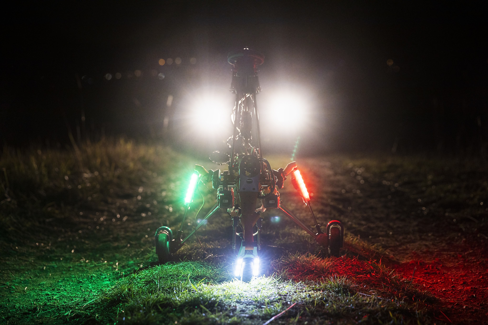

# TF-G1 - Unmanned Autogyro Extreme weather sensor carrier  

The TF-G1 autogyro created by ThunderFly s.r.o. is a [unmanned aerial vehicle (UAV)](https://en.wikipedia.org/wiki/Unmanned_aerial_vehicle) designed to be operable in almost any weather.
The main features of that design are:

  * Payload capacity of a few kilograms
  * Weather-insensitive operation
  * Low audible noise
  * High safety due to stable autorotation mode which does not require autopilot or pilot attention
  * Greater altitude and area coverage than existing UAV designs  like multi-copters or helicopters
  * Absence of [downwash](https://en.wikipedia.org/wiki/Downwash), therefore a minimal occurrence of [Brownout](https://en.wikipedia.org/wiki/Brownout_(aeronautics))
  * High descent rates
  * [Simulation model available](https://github.com/ThunderFly-aerospace/FlightGear-TF-G1)
  * High repairability and easy maintenance
  * Car roof takeoff ready

The benefits which come from this feature set are the usability of applications where the system could be potentially damaged, although the safety must remain as high as possible.  An example of this application is searching and rescue missions in harsh weather unflyable by conventional aircraft.

## Build

Most of the components are coded in OpenSCAD. To render all components run the following commands in Linux CLI:

    sudo pip install stlsort

    sudo apt install python3-numpy-stl

    make

The design files and related documents are covered by [GNU GENERAL PUBLIC LICENSE Version 3](https://www.gnu.org/licenses/gpl-3.0.en.html)

For additional information contact ThunderFly s.r.o. representative at info@thunderfly.cz
