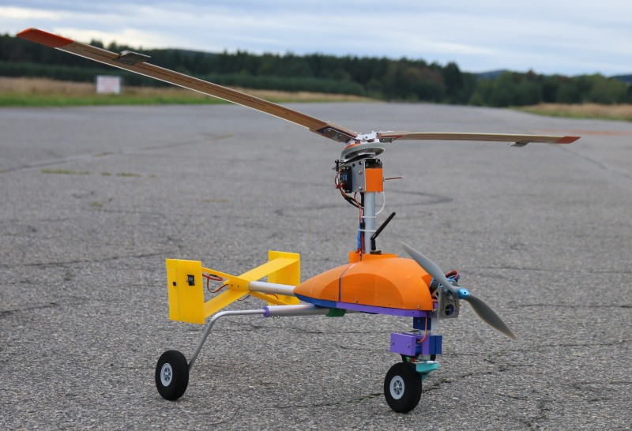

# TF-G1 UAV autogyro

The TF-G1 autogyro created by ThunderFly s.r.o. is a [unmanned aerial vehicle (UAV)](https://en.wikipedia.org/wiki/Unmanned_aerial_vehicle) designed to be operable in almost any weather. 
The main features of that design are:

  * Weather insensitive operation
  * High safety due to stable autorotation mode which does not require autopilot or pilot attention
  * Greater altitude and area coverage than existing UAV designs  like multi-copters or helicopters
  * Absence of [downwash](https://en.wikipedia.org/wiki/Downwash)
  * High descent rates
  * Ability to enter and return into the fail-safe mode (stable autorotation)

The benefits which come of this feature set are usability of application where the system could be potentially damaged, although the safety must retain as high as possible.  The example of this applications is searching and rescue missions in the hars weather unflyable by conventional aircraft. 

For additional information contact ThunderFly s.r.o. representative at info@thunderfly.cz
