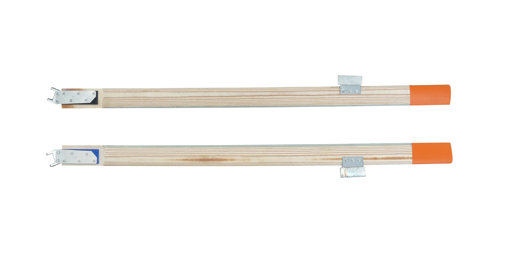
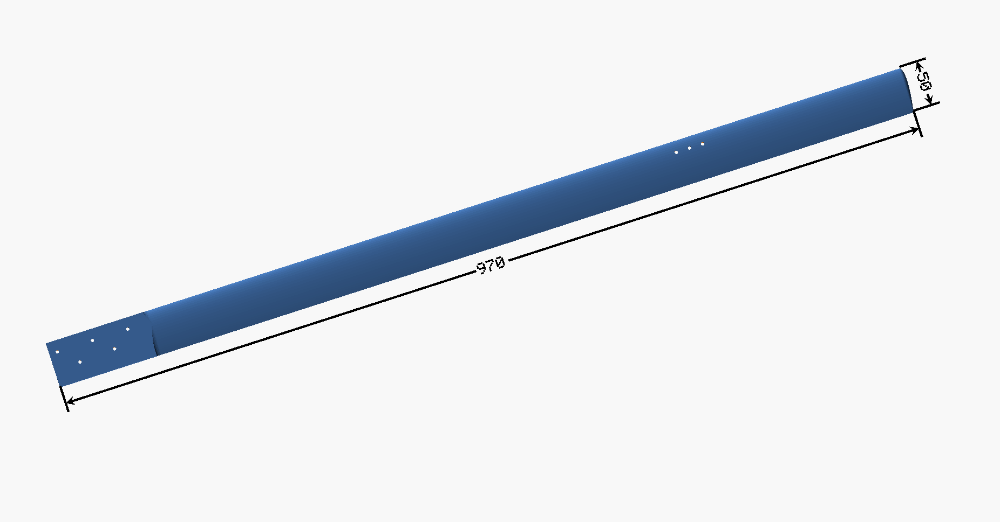

## Rotorové listy pro vírník TF-G1

Rotorové listy vírníku TF-G1 jsou vícevrstvé z dřevo-skelného kompozitu. Každý list je pečlivě CNC frézován ve dvojici s druhým rotorovým listem pro udržení  precizního vyvážení každého rotorového páru.

Konstrukce listu je založena na sendvičové konstrukci, kde vnitřní stringer je dimenzován pro maximální únosnost 4kN, což odpovídá maximálním otáčkám 1500 ot/minutu.  Všechny vrstvy sendviče jsou vakuově lisovány pro eliminaci vzniku bublinek ve vnitřních lepených spojích.
Listy jsou vytvrzeny v autoklávu a povrchově ošetřeny epoxidovým lakem.

Závěs rotorového listu je navržen pro využití na Delta-3 rotorové hlavě s kluznými ložisky a broušeným ocelovým čepem 4H9.

Hlavní parametry rotorových listů

  - Aerodynamický profil NACA0016
  - Aerodynamické křížení: žádné
  - Průmět - obdélníkový
  - Hloubka listu 50mm
  - Délka 970mm
  - Maximální otáčky - 1500
  - Materiál: březový kompozit v kombinaci se skelnými vlákny FR4.
  - Hmotnost 564g
  - Typ kování: Pro Delta-3 rotorovou hlavu
